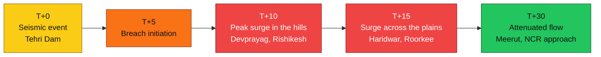
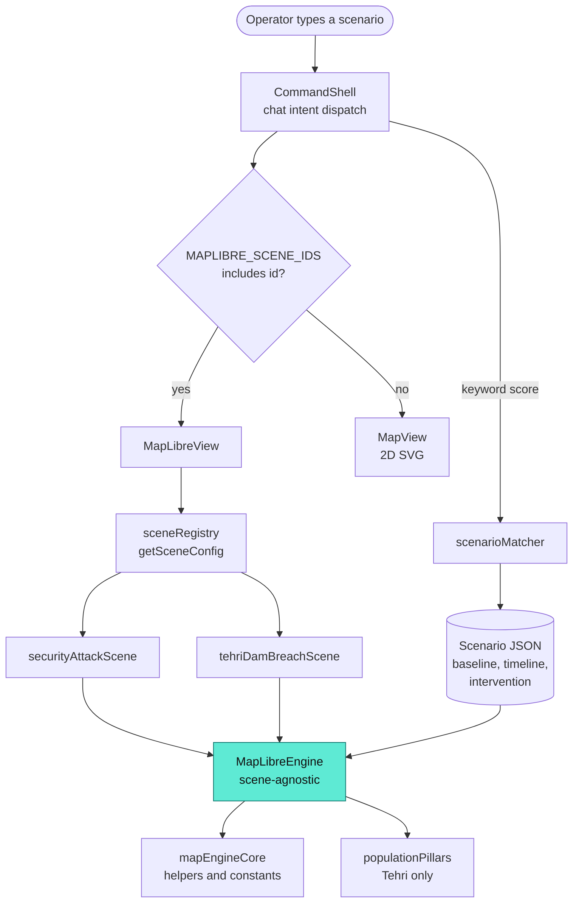
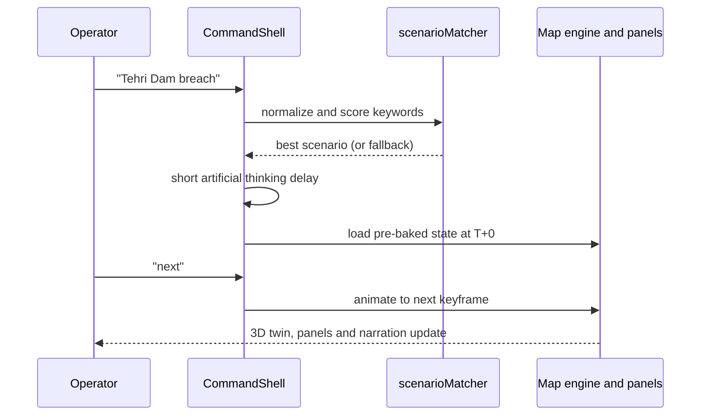

<div align="center">

# ForeSeen

### *Describe a disaster. Watch a city respond, in 3D, from T+0 to T+30.*

<br/>


**[Demo](#demo)** &nbsp;|&nbsp; **[Features](#key-features)** &nbsp;|&nbsp; **[Scenarios](#scenarios)** &nbsp;|&nbsp; **[Architecture](#architecture)** &nbsp;|&nbsp; **[Get started](#getting-started)** &nbsp;|&nbsp; **[How it works](#how-it-works-honest)** &nbsp;|&nbsp; **[Roadmap](#known-limitations-and-roadmap)**

</div>

---

## What is ForeSeen?

ForeSeen is a **disaster management simulation platform** concept: a command-center interface where an operator describes an emergency in plain language and a 3D digital twin of the affected area responds.

> ### The problem
> Emergency planners rarely see how population, roads and shelters interact until a crisis is already unfolding. Existing tools are slow to set up and hard to explain to the people who must decide.

> ### The idea
> Type a scenario. The twin colors buildings by risk, jams the roads that would jam, flags shelters that become unreachable, and lets you scrub a timeline from **T+0 to T+30**. A causal breakdown explains *why* it is bad; a baseline vs intervention comparison shows *what a response would change*.

> ### Honest scope
> This is a **hackathon demo** built for the Smart India Hackathon (SIH). Scenarios are **pre-modelled** and every figure is **illustrative**. That is a deliberate design choice: it lets the interface, the 3D twin and the decision workflow be shown end to end without live data feeds or a real simulation engine. See [How it works](#how-it-works-honest).

<br/>

<table align="center">
<tr>
<td align="center" width="25%"><h2>4</h2>scenarios<br/><sub>+ 1 fallback</sub></td>
<td align="center" width="25%"><h2>2</h2>full 3D scenes<br/><sub>Delhi and Tehri corridor</sub></td>
<td align="center" width="25%"><h2>5</h2>timeline keyframes<br/><sub>T+0, 5, 10, 15, 30</sub></td>
<td align="center" width="25%"><h2>12</h2>population pillars<br/><sub>Tehri corridor</sub></td>
</tr>
</table>

---

## Demo

<!-- TODO: replace with real assets. Do not commit placeholder URLs. -->

<div align="center">

| Screenshot | GIF | Video | Live site |
|:---:|:---:|:---:|:---:|
| `TODO` add e.g. `docs/tehri.png` | `TODO` T+0 to T+30 flood walkthrough | `TODO` YouTube link | `TODO` deployment URL, if any |

</div>

**Suggested 60-second walkthrough:** type `Tehri Dam breach` → press **play** on the timeline (or type `next`) → toggle **Shelters** → toggle **Population** → ask `what if shelter capacity increased by 40%` → type `reset`.

---

## Key features

### Understand
| | Feature | What you get |
|:-:|---|---|
|  | **Natural-language input** | Type what happened; a keyword matcher selects the pre-modelled scenario, after a short "thinking" animation |
|  | **Causal breakdown** | Four factors per scenario: shelter deficit, population density, road accessibility, infrastructure |
|  | **Baseline vs intervention** | Side-by-side evacuation time, overload % and high-risk zone count |

### See
| | Feature | What you get |
|:-:|---|---|
|  | **3D digital twin** | MapLibre GL map with extruded buildings, tilt and rotate, dark / light / satellite themes |
|  | **Impact zones** | Red, yellow and green concentric bands that grow across the timeline |
|  | **Timeline T+0 to T+30** | Five keyframes with a scrubber, chat commands, and per-keyframe narration |
|  | **Road jam detection** | Nearby named roads classified as clear, congested or jammed from the impact geometry |
|  | **Tehri Dam flood corridor** | A flood ribbon following a river path from the dam toward Meerut, pooling wider at Devprayag and Rishikesh |
|  | **Population-entrapment pillars** | 3D bars per area showing people trapped, cut-off status and a severity score (Tehri only) |

### Act
| | Feature | What you get |
|:-:|---|---|
|  | **Shelter cards and accessibility** | Floating cards with occupancy, distance and accessible / blocked status |
|  | **Capacity what-if** | Ask for +X% shelter capacity and shelters, badges and pillars update live |
|  | **Clickable labels** | Click a shelter, landmark, road or pillar label and the camera flies to it |
|  | **Chat commands** | `next`, `T+15`, `list all blocked roads`, `shelters in range`, `reset`, `cls` |

---

## Scenarios

<table>
<tr>
<th>Scenario</th><th>id</th><th>Trigger words</th><th>Renderer</th>
</tr>
<tr>
<td><br/><b>Hostile Attack</b><br/><sub>Central Delhi, near Parliament House</sub></td>
<td><code>security-attack</code></td>
<td>attack, hostile, terror, bomb, blast, gunfire</td>
<td></td>
</tr>
<tr>
<td><br/><b>Earthquake</b><br/><sub>Central Delhi zone</sub></td>
<td><code>earthquake</code></td>
<td>earthquake, tremor, seismic, aftershock</td>
<td></td>
</tr>
<tr>
<td><br/><b>Flood</b><br/><sub>Yamuna floodplain, Delhi</sub></td>
<td><code>flood</code></td>
<td>flood, yamuna, monsoon, heavy rain</td>
<td></td>
</tr>
<tr>
<td><br/><b>Dam Breach</b><br/><sub>Tehri Dam to Meerut / NCR</sub></td>
<td><code>tehri-dam-breach</code></td>
<td>tehri, dam breach, dam failure, ganga flood</td>
<td></td>
</tr>
<tr>
<td><br/><b>Generic fallback</b><br/><sub>Nominal conditions</sub></td>
<td><code>generic-fallback</code></td>
<td><i>none, used when nothing matches</i></td>
<td></td>
</tr>
</table>

> Only **Hostile Attack** and **Dam Breach** have 3D buildings, camera choreography and (for Dam Breach) population pillars. The other three use the earlier 2D map.

### Spotlight: Tehri Dam breach

A scripted M6.8 earthquake triggers a dam failure, and the flood front travels roughly 230 km down a schematic Ganga corridor (Tehri Dam to the Meerut / NCR approach).



<details>
<summary><b>The 12 population pillars (click to expand)</b></summary>

<br/>

Each pillar's height is the number of trapped people (illustrative), colored by a 0 to 100 **Entrapment Severity Index** (yellow ≥ 25, orange ≥ 50, red ≥ 75), and outlined red when every road out is blocked.

Koti Colony (Dam Township) · Bhagirathi Valley Hamlets · Devprayag · Muni Ki Reti / Tapovan · Rishikesh (Ram Jhula) · Raiwala · Haridwar (Har Ki Pauri) · Jwalapur · Roorkee (IIT Side) · Muzaffarnagar (River Edge) · Khatauli · Meerut Approach

The index weights trapped share of the exposed population (40), all roads blocked (25), short warning time (15), children and elderly share (10), and nearest shelter headroom (10). It is an **illustrative model**, not an epidemiological one.

</details>

### Risk colors used everywhere

| | Level | Hex |
|:-:|---|---|
|  | Green, safe | `#22c55e` |
|  | Yellow, watch | `#facc15` |
|  | Orange, serious | `#f97316` |
|  | Red, critical | `#ef4444` |

---

## Tech stack

Versions are the ranges declared in `package.json`.

| Layer | Technology | Version | Used for |
|:-:|---|---|---|
|  | **React / React DOM** | ^19.2.8 | UI and state |
|  | **Vite** | ^8.2.2 | Dev server and build |
|  | `@vitejs/plugin-react` | ^6.1.0 | JSX transform |
|  | **Tailwind CSS** | ^3.4.13 | Styling and design tokens |
|  | PostCSS + Autoprefixer | ^8.5.28 + ^10.5.5 | CSS pipeline |
|  | **MapLibre GL JS** | ^6.7.0 | 3D map, symbol layers, extrusions |
|  | **Turf.js** (`@turf/turf`) | ^7.4.0 | Distances, buffers, line geometry |
|  | oxlint | ^1.79.0 | Linting |

**Basemaps:** OpenFreeMap (dark, Liberty) and Esri World Imagery (satellite). No API key, but an internet connection is required.
**No backend, no database.** All data is local JSON and JS modules.

---

## Architecture

### One engine, many scenes

`MapLibreEngine.jsx` contains **no scenario-specific constants**. Each scene is a plain config object that supplies its own geography and data, so adding a scene does not touch the engine.



<details>
<summary><b>What a scene config supplies (click to expand)</b></summary>

<br/>

| Field | Required | Purpose |
|---|:-:|---|
| `fallbackCenter`, `defaultRadii` |  | Initial camera center and default red / yellow / green radii (km) |
| `landmarks`, `landmarkIds` |  | Named places that get label pills |
| `shelters`, `inaccessibleShelterId` |  | Shelter roster and the one that becomes unreachable |
| `corridorPattern`, `corridorLabel` |  | Road-name regex that force-jams at the activation keyframe |
| `forcedJamActivationLabel`, `blockedShelterLabel` |  | When the jam kicks in and the blocked-shelter text |
| `firstFocusShelterId` |  | Shelter the first "shelters in range" query flies to |
| `pinImpactZoneCenter` |  | Pin the drawn impact circle to a fixed point (Tehri: the dam) |
| `floodPath`, `floodHotspots` |  | River path polyline and local pooling points |
| `cameraKeyframes` |  | Per-keyframe zoom, tilt and follow-the-front camera moves |
| `populationPillars` |  | Entrapment pillar dataset (Tehri) |

</details>

### Project layout

```
src/
├── components/
│   ├── CommandShell.jsx        layout, state, chat intent dispatch
│   ├── ChatPanel.jsx · ChatMessage.jsx · TimelineScrubber.jsx
│   ├── CausalBreakdown.jsx · ComparisonPanel.jsx · PopulationPanel.jsx
│   ├── MapToolbar.jsx · MapView.jsx (2D) · MapLibreView.jsx (wrapper)
│   └── maplibre/
│       ├── MapLibreEngine.jsx  scene-agnostic 3D engine
│       ├── mapEngineCore.js    shared constants and helpers
│       ├── populationPillars.js  sizing, placement, severity model
│       ├── sceneRegistry.js    scenario id → scene config
│       └── scenes/
│           ├── securityAttackScene.js
│           └── tehriDamBreachScene.js
├── data/                       landmarks, shelters, flood pillars
├── scenarios/                  one JSON per scenario + presets
└── utils/                      matcher, intent parsers, analyst text
```

---

## Getting started

**Prerequisites:** Node.js `20.19+` or `22.12+` (the range Vite 8 declares) and npm.

```bash
npm install
npm run dev        # start the dev server
npm run build      # production build
npm run preview    # serve the production build locally
npm run lint       # oxlint
```

### Example prompts

Each was checked against the real keyword matcher.

| Scenario | Try typing |
|---|---|
|  Hostile Attack | `high-severity hostile attack in Central Delhi` |
|  Earthquake | `earthquake near this zone` |
|  Flood | `heavy rain and Yamuna flood in Delhi` |
|  Dam Breach | `Tehri Dam breach` &nbsp;or&nbsp; `dam failure at Tehri` |
|  Fallback | any unrelated text, or the **Reset / Baseline** preset chip |

### Chat commands (once a scenario is active)

| Type | Effect |
|---|---|
| `next` · `T+15` | Advance or jump on the timeline |
| `list all blocked roads` · `roads` | Show road status, with the map flying to the result |
| `shelters in range` | List nearby shelters and fly to one |
| `what if shelter capacity increased by 40%` | Live capacity what-if with `+X%` badges |
| `apply intervention` | Swap in the scenario's authored intervention state |
| `show population` · `pillars` | Open the entrapment view (Dam Breach only) |
| `reset` | Back to T+0, keeping the scenario active |
| `cls` | Clear the chat log |

The **preset chips** at the bottom of the screen jump straight to each scenario without typing.

---

## How it works (honest)

ForeSeen does **not** run a simulation. Each scenario is a hand-authored JSON file with a baseline state, five timeline keyframes, an intervention state and comparison numbers.



| Real (computed live) | Authored (illustrative) |
|---|---|
| Distances, buffers and impact rings with Turf.js | Populations, trapped counts and flood depths |
| Road classification from impact geometry | Shelter capacities and occupancy |
| Flood ribbon width along the path | Flood arrival times and rescue windows |
| Pillar placement clear of the ribbon | Comparison stats (evacuation time, overload) |
| Severity index from the authored inputs | The Tehri flood path itself, a schematic corridor |

>  **Not for real decisions.** The flood path is not a surveyed river channel (it includes a deliberate artistic detour), and none of the numbers are census or hydrology data.

---

## Customization

### Add a new 3D scenario

1. **JSON:** create `src/scenarios/<your-scenario>.json` with `id`, `name`, `keywords`, `baseline`, `intervention`, a five-entry `timeline`, `causalFactors` and `comparisonStats` (copy an existing file).
2. **Register:** import it in `src/utils/scenarioMatcher.js` and add it to the `scenarios` array. Optionally add a preset chip in `src/scenarios/scenarioPresets.js`.
3. **Scene config:** create `src/components/maplibre/scenes/<yourScenario>Scene.js` using `securityAttackScene.js` as the template, plus data files under `src/data/` for its landmarks and shelters.
4. **3D switch:** add the scene to `SCENES` in `src/components/maplibre/sceneRegistry.js`. That derives `MAPLIBRE_SCENE_IDS`, which is what routes the scenario to the 3D engine.

Scenarios you do not register as a scene still work; they render on the 2D map.

### Tuning knobs

| To change | Edit |
|---|---|
| Label sizes and zoom behavior | `LABEL_HOLD_ZOOM`, `SHELTER_CARD_FAR_SIZE`, `LABEL_PILL_FAR_SIZE` in `mapEngineCore.js` |
| Landmark vs shelter label spacing | `LANDMARK_SHELTER_CLUSTER_KM`, `LANDMARK_STACK_GAP_PX` in `mapEngineCore.js` |
| Pillar height, radius and spacing | `HEIGHT_PER_PERSON`, `PILLAR_RADIUS_M_AT_REF`, `PILLAR_OFFSET_SCALE` and friends at the top of `populationPillars.js` |
| Tehri camera moves | `cameraKeyframes` in `scenes/tehriDamBreachScene.js` |
| First "shelters in range" target | `firstFocusShelterId` in each scene file |

---

## Known limitations and roadmap

<table>
<tr>
<td width="50%" valign="top">

### Current limitations
- Scenarios are pre-modelled; no real simulation
- Only 2 of 5 scenarios have the 3D treatment
- Needs internet for basemap tiles
- The Dam Breach "named corridor" road jam is best-effort and unverified against live map data
- Some chat text is still Delhi-specific in the Dam Breach scene
- Main JS chunk is about 1.65 MB before gzip

</td>
<td width="50%" valign="top">

### Roadmap ideas
- Live sensor, weather and census feeds
- Real hydrological and crowd-movement models
- LLM-based scenario understanding
- More 3D scenarios: cyclone, fire, industrial accident
- Migrate earthquake and flood to the 3D engine

</td>
</tr>
</table>

---

## Project status and verification

| Check | Result |
|---|---|
| `npm run build` |  succeeds (chunk-size warning only) |
| `npm run lint` |  0 errors, 26 warnings |
| 3D visuals in a live browser |  **not yet verified**; expect a round of by-eye tuning (pillar sizes, label positions, camera framing) |

---

## Team

- TODO: team name
- TODO: member names and roles
- TODO: mentor / institution

## Acknowledgements

- Basemap data: **OpenFreeMap** and **OpenStreetMap** contributors; satellite imagery: **Esri, Maxar, Earthstar Geographics**
- Built with React, Vite, Tailwind CSS, MapLibre GL JS and Turf.js
- TODO: any additional credits

## License

TODO: choose a license and add a `LICENSE` file.

<div align="center">

<br/>

*Built for the Smart India Hackathon. Figures are illustrative; the interface is real.*

</div>